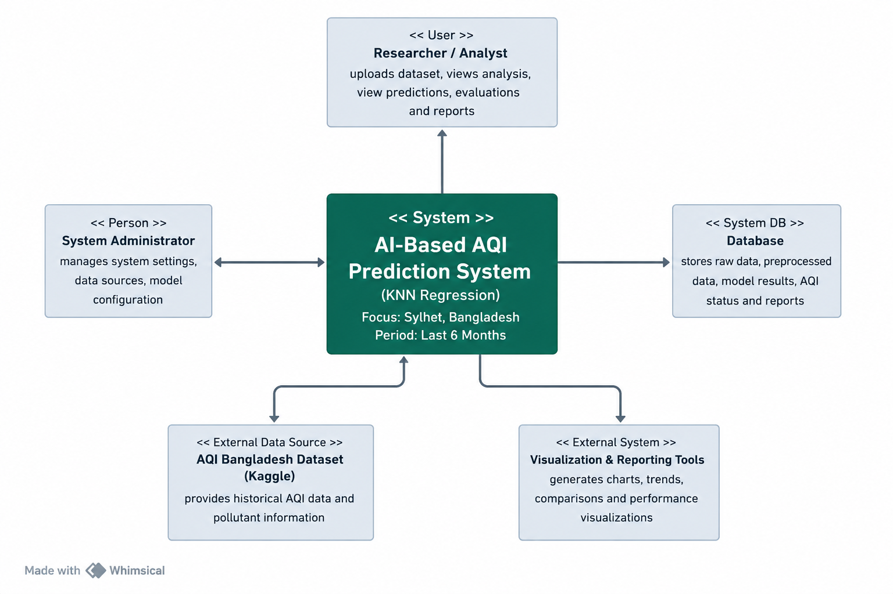

# Software Requirements Specification (SRS)

# Air Quality Index (AQI) Prediction System for Sylhet, Bangladesh

**Model:** KNN Regression  
**Dataset:** AQI Bangladesh Dataset  
**Focus Area:** Sylhet, Bangladesh  
**Prediction Period:** Last 6 Months Historical Data

----------

# Preface

This Software Requirements Specification (SRS) document describes the requirements for the AI-Based Air Quality Index (AQI) Prediction System. The system is designed to analyze historical air pollution data and predict AQI values for Sylhet, Bangladesh using a machine learning approach.

The system performs data preprocessing, exploratory data analysis, feature engineering, model training, prediction, and evaluation to provide AQI prediction results and air quality status categories.

----------

## Version History

* **Version 1.0** – Initial Draft.


----------

# 1. Introduction

## 1.1 Purpose

The purpose of this project is to develop an intelligent AQI prediction system that:

-   Predicts future Air Quality Index values
    
-   Analyzes pollution trends in Sylhet
    
-   Identifies relationships between pollutants and AQI
    
-   Categorizes AQI health conditions
    
-   Assists environmental monitoring and decision-making
    

----------

## 1.2 Document Conventions

This document follows IEEE SRS standards:


-   **Must** – Indicates mandatory requirements necessary for the proper functioning of the AQI Prediction System. For example, the system **must** *preprocess the dataset, perform feature scaling, train the KNN model, and generate AQI predictions.*

-   **Should** – Indicates recommended requirements that improve system performance and usability but are not strictly mandatory. For example, the system **should** *provide visualizations such as AQI trend graphs, heatmaps, and comparison plots.*

-   **May** – Indicates optional features or future enhancements that can be implemented if required. For example, the system **may** *support real-time AQI prediction, weather API integration, or additional machine learning algorithms.*
    

----------


## 1.3 Intended Audience

-   **Developers**  
    For understanding system implementation, including preprocessing, feature engineering, and KNN model development.
    
-   **Researchers**  
    For analyzing the machine learning approach, feature selection, and model performance evaluation.
    
-   **Environmental Analysts**  
    For studying AQI trends, pollution patterns, and seasonal/hourly variations in Sylhet.
    
-   **Testers**  
    For validating data processing, prediction accuracy, and output correctness.
    
-   **Stakeholders**  
    For understanding system goals, AQI prediction results, and environmental insights.

----------

## 1.4 Scope

The system provides:

-   Dataset loading
    
-   Data preprocessing
    
-   Outlier detection and removal
    
-   Exploratory Data Analysis (EDA)
    
-   Feature engineering
    
-   KNN model training
    
-   K-value optimization
    
-   AQI prediction
    
-   AQI status classification
    
-   Model evaluation
    
-   Data visualization
    

----------

## 1.5 References

-   IEEE Standard 830-1998
    
-   Kaggle AQI Bangladesh Dataset
    
-   Python Documentation
    
-   Scikit-learn Documentation
    
-   Research papers on AQI prediction
    

----------

# 2. Overall Description

## 2.1 Product Perspective

The AQI Prediction System is a standalone machine learning-based analytical system.

Technologies used:

### Programming Language

-   Python
    

### Development Platform

-   Google Colab
    

### Libraries

-   Pandas
    
-   NumPy
    
-   Matplotlib
    
-   Seaborn
    
-   Scikit-learn
    

----------

## 2.2 Product Functions

### Data Import Module

The system shall:

-   Read AQI dataset from CSV
    
-   Load dataset from Google Drive
    

----------

### Data Preprocessing Module

The system shall:

-   Convert datetime format
    
-   Filter last six months of records
    
-   Filter Sylhet city data
    
-   Generate new time features
    

Features created:

-   Month
    
-   Hour
    

The system shall remove:

-   Unnecessary columns
    
-   Missing AQI values
    
-   AQI outliers using IQR
    

----------

### Exploratory Data Analysis Module

The system shall generate:

#### Statistical Summary

-   Mean
    
-   Median
    
-   Standard deviation
    

#### Visualization Graphs

-   AQI Distribution Histogram
    
-   AQI Boxplot
    
-   Correlation Heatmap
    
-   Seasonal AQI Trend
    
-   Hourly AQI Trend
    
-   Scatter plots between pollutants and AQI
    

----------

### Feature Selection Module

Selected features:

-   PM2.5
    
-   PM10
    
-   Nitrogen Dioxide
    
-   Sulphur Dioxide
    
-   Carbon Monoxide
    
-   Ozone
    
-   Hour
    
-   Month
    

Target variable:

```text
AQI

```

----------

### Data Scaling Module

The system shall apply:

```text
StandardScaler

```

Purpose:

-   Normalize data values
    
-   Improve KNN performance
    

----------

### Model Training Module

The system shall:

-   Split dataset into training and testing data
    
-   Train KNN Regression model
    

Training ratio:

```text
80% Training
20% Testing

```

Random state:

```text
42

```

----------

### K Optimization Module

The system shall:

-   Evaluate K values from 1–20
    
-   Calculate RMSE for each K
    
-   Select K with minimum RMSE
    

Method used:

```text
Elbow Method

```

----------

### Prediction Module

The system shall:

-   Predict AQI values
    
-   Compare predicted and actual values
    

----------

### AQI Status Classification Module

The system shall classify AQI into:

| **AQI Range** | **Status** |
| --- | --- |
| **0–50**| Good
| **51–100**| Moderate
| **101–150**| Unhealthy for Sensitive Groups
| **151–200**| Harmful
| **201–300**| Very Harmful
| **300+**| Severe

----------

### Visualization Module

The system shall generate:

-   Predicted vs Actual AQI comparison chart
-   Color-coded AQI status graph
-   Actual vs Predicted scatter plot
-   Residual plot
    

----------

### Performance Evaluation Module

The system shall calculate:

-   RMSE
-   MAE
-   R² Score
    

----------

# 2.3 User Classes and Characteristics

### Environmental Researcher

Can:

-   Analyze pollution trends
-   Study AQI patterns
    

----------

### General User

Can:

-   View AQI prediction results
    

----------

### Environmental Agencies

Can:

-   Use predictions for monitoring purposes
    

----------

# 2.4 Operating Environment

### Software Requirements

-   Python 
-   Google Colab
    

Required libraries:

-   Pandas   
-   NumPy   
-   Matplotlib  
-   Seaborn   
-   Scikit-learn
    

----------

### Hardware Requirements

Minimum:

-   RAM: 4GB
-   Storage: 2GB
    

Recommended:

-   RAM: 8GB+
    

----------

## 2.5 Design Constraints

The system:

-   Depends on dataset availability
    
-   Requires internet connection for Google Drive access
    
-   Depends on quality of historical AQI data
    

----------

## 2.6 Assumptions and Dependencies

Assumptions:

-   Dataset values are accurate   
-   Pollutant values significantly affect AQI
    

Dependencies:

-   Kaggle dataset
-   Google Drive storage
-   Python libraries
    

----------

# 3. System Requirements Specification

## Functional Requirements

### FR-1 Dataset Loading

The system must load AQI dataset successfully.

----------

### FR-2 Data Preprocessing

The system must:

-   Handle missing values
-   Remove outliers
-   Generate time features

----------

### FR-3 Data Visualization

The system must create graphical analysis.

----------

### FR-4 Feature Scaling

The system must normalize data using StandardScaler.

----------

### FR-5 Model Training

The system must train KNN Regression model.

----------

### FR-6 Best K Selection

The system must determine optimal K value.

----------

### FR-7 AQI Prediction

The system must predict AQI values.

----------

### FR-8 AQI Status Mapping

The system must categorize AQI health status.

----------

### FR-9 Performance Evaluation

The system must calculate:

-   RMSE
-   MAE
-   R² score
    

----------

## Non-Functional Requirements

### Performance Requirements

The system should:

-   Produce prediction results within a few seconds
    
-   Efficiently process large datasets
    

----------

### Reliability Requirements

The system should:

-   Produce consistent prediction results
    

----------

### Security Requirements

The system must:

-   Restrict unauthorized dataset access
    

----------

### Usability Requirements

The system should:

-   Display understandable visualizations
    

----------

### Maintainability Requirements

The system should:

-   Support future model replacement
    

----------

### Portability Requirements

The system should run on:

-   Windows
-   Linux
-   MacOS
-   Google Colab
    

----------

# 4. System Models

## Context Diagram




----------

# 5. System Evolution

Future improvements may include:

-   Real-time AQI prediction
    
-   Weather API integration
    
-   Deep learning models 
    
-   Multi-city prediction
    
-   Web dashboard implementation
    
-   Mobile application support
    

----------

# 6. Appendices

## Dataset Features

Input variables:

-   PM2.5
-   PM10
-   Nitrogen Dioxide
-   Sulphur Dioxide
-   Carbon Monoxide
-   Ozone 
-   Hour
-   Month
    

Output variable:

-   AQI
    

----------

## Model Summary

| Metric | Value |
| --- | --- |
| Model | KNN Regression |
| Best K | 2 |
| RMSE | 10.8563 |
| MAE | 6.6533 |
| R² Score | 0.8139 |


**Conclusion:** KNN Regression achieved good prediction performance for AQI prediction in Sylhet and explained approximately **81.39%** of AQI variance using selected environmental features.
